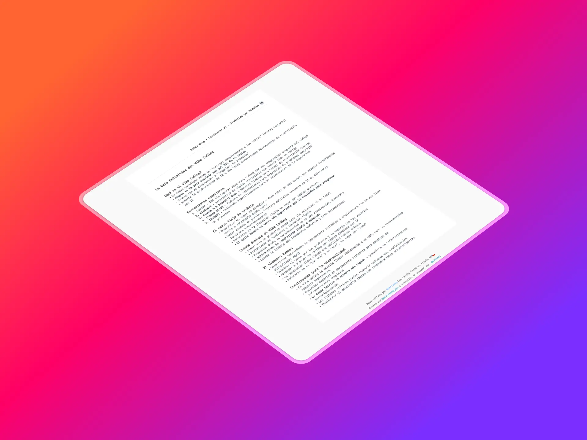

# Basado en el archivo Vibe Coding de Peter Wong

<p aling="center">
    
</p>

### Tecnologías usadas

[Deno Fresh](https://fresh.deno.dev/docs/getting-started) para el desarrollo de la aplicación.

[Taildwind CSS](https://tailwindcss.com/docs) para el diseño de la aplicación.

[Deno Deploy](https://deno.com/deploy/docs) para el despliegue de la aplicación.
\*\*

### Información
[Post Linkedin Miduedev](https://www.linkedin.com/posts/midudev_he-traducido-la-gu%C3%ADa-del-vibe-coding-por-activity-7305964730001596416-dTiG?utm_source=share&utm_medium=member_desktop&rcm=ACoAAB3PwcUBiv3bSv2wXSWJredG6j5r6cHfe4M)

[Post X Peter](https://x.com/peterwong_xyz/status/1898090027873452542)

### Usage

Make sure to install Deno: https://deno.land/manual/getting_started/installation

Then start the project:

```
deno task start
```
