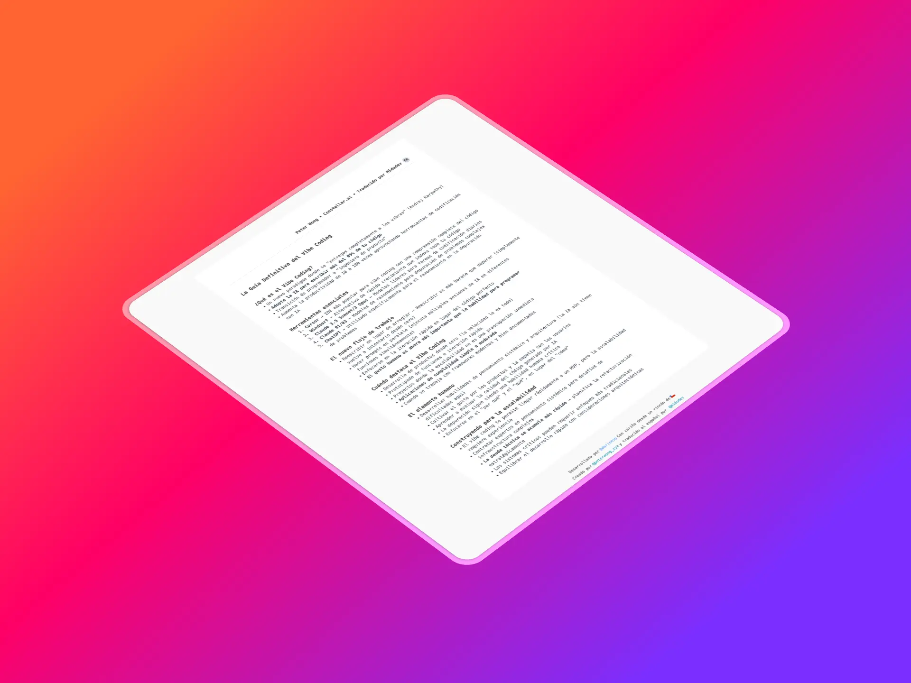

# Vibe Coding - La Guía Definitiva

> Basado en el trabajo de Peter Wong · Creado por
> [@daesdev](https://github.com/daesdev)

<p align="center">
    
</p>

### Tecnologías usadas

[Deno Fresh](https://fresh.deno.dev/docs/getting-started) para el desarrollo de
la aplicación.

[Tailwind CSS](https://tailwindcss.com/docs) para el diseño de la aplicación.

[Cloudflare Workers](https://developers.cloudflare.com/workers/) para el
despliegue de la aplicación.

### Deploy

```bash
deno task deploy
```

### Información

[Post Linkedin Midudev](https://www.linkedin.com/posts/midudev_he-traducido-la-gu%C3%ADa-del-vibe-coding-por-activity-7305964730001596416-dTiG?utm_source=share&utm_medium=member_desktop&rcm=ACoAAB3PwcUBiv3bSv2wXSWJredG6j5r6cHfe4M)

[Post X Peter](https://x.com/peterwong_xyz/status/1898090027873452542)

### Usage

Make sure to install Deno: https://deno.land/manual/getting_started/installation

Then start the project:

```bash
deno task start
```
